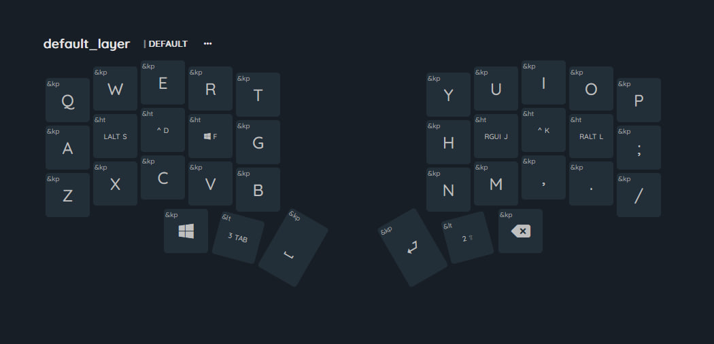
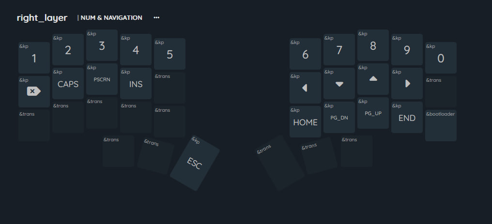
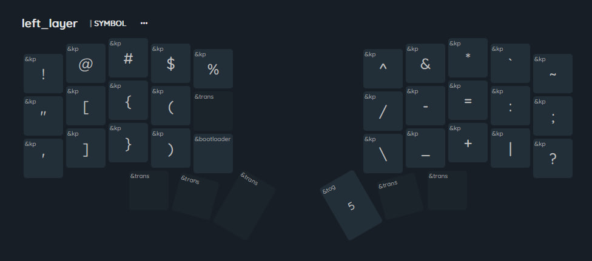
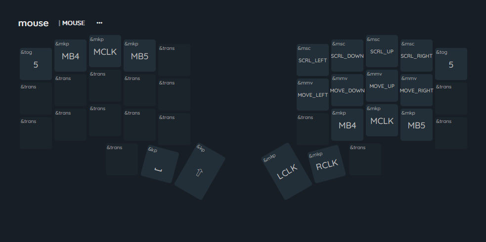

# ZMK firmware for Kin36, Sweep36, Sweep Squared
[Английская версия](README_ru.md)
ZMK Firmware for Kin36, Sweep36 (ZMK Cradio shield but with 36 keys), Sweep Squared, Swoop36 and other 3x5 keyboards with full diodeless matrix and default ProMicro-compatible BLE MCU (nice!nano, ProMicro NRF52840, TENSTAR ROBOT NRF52840, etc).

## Quick Start

### Flash new firmware

1. Fork this repo
2. (optional) Update keymap and config file
3. Wait for GitHub Actions to build the firmware, then download and decompress the zip file
4. Connect the left or right half to your computer with a USB cable
5. Make the left or right half enter bootloader. You can enter bootloader by:
   1. double-clicking the reset button
   2. quickly short-circuiting the reset button twice (if the button is not working)
   3. quickly short-circuiting the GND & RST pins of the controller twice (not the VCC 3.3V or RAW 5V pins!)
6. Copy the firmware to the corresponding half of the keyboard (updating keymap or keyboard name does not require flashing the right half)
   1. filename with `left` is for the left half
   2. filename with `right` is for the right half
   3. filename with `reset` is for either half to forget its Bluetooth connection info (use when left & right halves cannot connect, to forget paired devices)

## Characters

- The default layer and windows layer are where you type characters.
- Both layers have modifier keys `CTRL`, `OPTION (ALT)`, `COMMAND (WINDOWS)` sharing the same positions as the character keys on your ring finger, middle finger and index finger on both hands. Hold the key to trigger the modifier, or tap the key to type the character.

## Numbers and Navigation

- Hold the right tab to enter the right layer, then you can type numbers or navigate.
- Release your right tab to return to the default or windows layer.
- Special keys:
  - `&bootloader` – make the right half enter bootloader, so you can copy new firmware to it.

## Punctuations

- Hold the left tab to enter the left layer, then you can type punctuation.
- Release your left tab to return to the default or windows layer.
- Special keys:
  - `&default_report` – type out battery information
  - `&bootloader` – make the left half enter bootloader, so you can copy new firmware to it
  - `5` – switch to mouse layer

## Functions

- Hold both the left and right tabs to enter the tri layer, then you can type function keys.
  - `BT_SEL_#` – select the Bluetooth profile slot you are connecting or want to connect to
  - `BT_CLR` – clear the connection on the selected slot, so you can reconnect a device to that slot
  - `OUT_TOG` – toggle between USB and Bluetooth, allowing up to 6 connections (5 Bluetooth + 1 USB)
  - `&tog 1` – toggle the windows layer on/off (switch between default and windows layer)
  - `&studio_unlock` – unlock the keyboard so you can use [zmk studio](https://zmk.dev/docs/features/studio#keymap-changes) to remap keys
  - `&soft_off` – enter soft off (like deep sleep after an hour of inactivity, but can only be woken by wake-up keys, set to left thumb: `shift`)
- Release the tab keys to return to the default or windows layer.

## Mouse

- Hold left tab (to enter left layer), and press the space key to enter the mouse layer
- Press `p` or `q` to quit the mouse layer
- `MB4` is for going backward, `MB5` is for going forward

